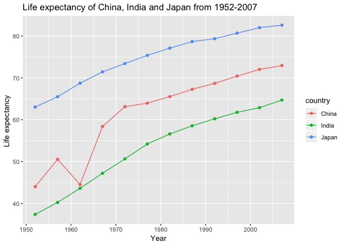

hw04-lh563
================
Lu Han
10/4/2018

### Homework 04: Tidy data and joins

``` r
suppressPackageStartupMessages(library("gapminder"))
suppressPackageStartupMessages(library("tidyverse"))
```

Activity \#2

Make a tibble with one row per year and columns for life expectancy for two or more countries. Use knitr::kable() to make this table look pretty in your rendered homework. Take advantage of this new data shape to scatterplot life expectancy for one country against that of another.

``` r
#I want to filter get the data from only China, India and Japan
gap_reshape<-gapminder %>% 
  select(country, year, lifeExp) %>% 
  group_by(country) %>% 
  filter(country=="China"|country=="India"|country=="Japan")

#?knitr::kable
  spread(gap_reshape,key=country,value=lifeExp) %>% 
  knitr::kable(caption="China,India and Japan's life expectancy in different years",
               align = "c")
```

|   year   |    China    |    India   |                Japan                |
|:--------:|:-----------:|:----------:|:-----------------------------------:|
|   1952   |   44.00000  |   37.373   |                63.030               |
|   1957   |   50.54896  |   40.249   |                65.500               |
|   1962   |   44.50136  |   43.605   |                68.730               |
|   1967   |   58.38112  |   47.193   |                71.430               |
|   1972   |   63.11888  |   50.651   |                73.420               |
|   1977   |   63.96736  |   54.208   |                75.380               |
|   1982   |   65.52500  |   56.596   |                77.110               |
|   1987   |   67.27400  |   58.553   |                78.670               |
|   1992   |   68.69000  |   60.223   |                79.360               |
|   1997   |   70.42600  |   61.765   |                80.690               |
|   2002   |   72.02800  |   62.879   |                82.000               |
|   2007   |   72.96100  |   64.698   |                82.603               |
| The data | can be pres | ented nice | ly with scattered points and lines. |

``` r
gap_reshape %>% 
  ggplot(aes(year,lifeExp)) +
  geom_point(aes(color=country))+
  geom_line(aes(color=country))+
  xlab("Year")+
  ylab("Life expectancy ")+
  ggtitle("Life expectancy of China, India and Japan from 1952-2007")
```

 As we can see from the plot that the life expectancy in Chian decreased significantly in 1962. This is due to the Cultural Revolution happening in China in the 1960s which killed millions of people.

### Activity \#2

Create your own cheatsheet patterned after Jenny’s but focused on something you care about more than comics! Inspirational examples: \#First,let's input the dataframe. It listed some of the restaurants in the Vancouver and my taste to some of them.

``` r
restaurants<-tibble(name=c('Kinyo','Miku','Lupo','Blue water cafe','The victor'),country=c('Japan','Japan','Italy','Canada','Canada'),price=c('moderate','high','low','high','high'),food=c('sushi','sushi','Mexican','Seafood','Steak'))
  
knitr::kable(restaurants)                   
```

| name            | country | price    | food    |
|:----------------|:--------|:---------|:--------|
| Kinyo           | Japan   | moderate | sushi   |
| Miku            | Japan   | high     | sushi   |
| Lupo            | Italy   | low      | Mexican |
| Blue water cafe | Canada  | high     | Seafood |
| The victor      | Canada  | high     | Steak   |

``` r
my_taste<-tibble(name=c('Kinyo','Miku','Lupo'),ranking=c('like','like','dislike'))
```

### Next we will try left\_join(),inner\_join(),full\_join(),semi\_join() and anti\_join() based on the two datasets we just created.

``` r
left_join(restaurants,my_taste,by="name") %>% 
  knitr::kable(format="markdown")
```

| name            | country | price    | food    | ranking |
|:----------------|:--------|:---------|:--------|:--------|
| Kinyo           | Japan   | moderate | sushi   | like    |
| Miku            | Japan   | high     | sushi   | like    |
| Lupo            | Italy   | low      | Mexican | dislike |
| Blue water cafe | Canada  | high     | Seafood | NA      |
| The victor      | Canada  | high     | Steak   | NA      |

``` r
right_join(restaurants,my_taste,by="name") %>% 
  knitr::kable(format="markdown")
```

| name  | country | price    | food    | ranking |
|:------|:--------|:---------|:--------|:--------|
| Kinyo | Japan   | moderate | sushi   | like    |
| Miku  | Japan   | high     | sushi   | like    |
| Lupo  | Italy   | low      | Mexican | dislike |

``` r
inner_join(restaurants,my_taste,by="name") %>% 
  knitr::kable(format="markdown")
```

| name  | country | price    | food    | ranking |
|:------|:--------|:---------|:--------|:--------|
| Kinyo | Japan   | moderate | sushi   | like    |
| Miku  | Japan   | high     | sushi   | like    |
| Lupo  | Italy   | low      | Mexican | dislike |

``` r
full_join(restaurants,my_taste,by="name") %>% 
  knitr::kable(format="markdown")
```

| name            | country | price    | food    | ranking |
|:----------------|:--------|:---------|:--------|:--------|
| Kinyo           | Japan   | moderate | sushi   | like    |
| Miku            | Japan   | high     | sushi   | like    |
| Lupo            | Italy   | low      | Mexican | dislike |
| Blue water cafe | Canada  | high     | Seafood | NA      |
| The victor      | Canada  | high     | Steak   | NA      |

``` r
semi_join(restaurants,my_taste,by="name") %>% 
  knitr::kable(format="markdown")
```

| name  | country | price    | food    |
|:------|:--------|:---------|:--------|
| Kinyo | Japan   | moderate | sushi   |
| Miku  | Japan   | high     | sushi   |
| Lupo  | Italy   | low      | Mexican |

``` r
anti_join(restaurants,my_taste,by="name") %>% 
  knitr::kable(format="markdown")
```

| name            | country | price | food    |
|:----------------|:--------|:------|:--------|
| Blue water cafe | Canada  | high  | Seafood |
| The victor      | Canada  | high  | Steak   |
